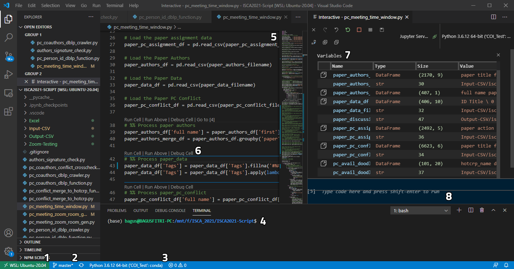
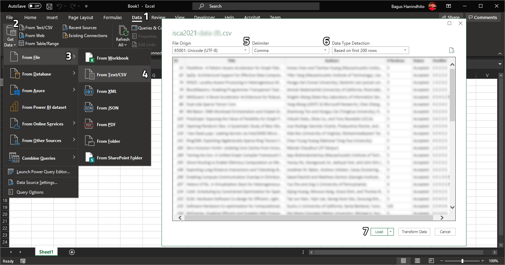
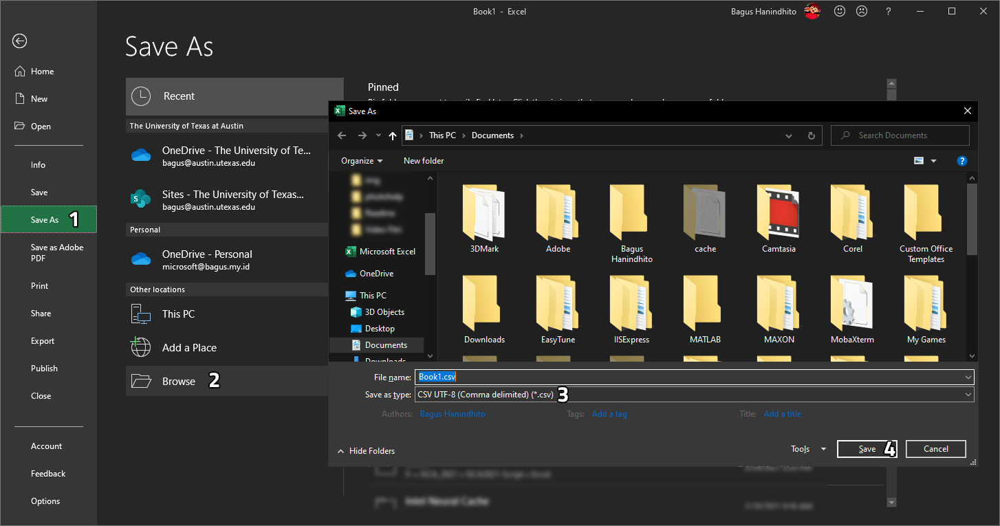

# ISCA-2021-Script


<br />
<p align="center">

  <h3 align="center">ISCA 2021 Script</h3>

  <p align="center">
    A collection of redistributable Python script to help organize ISCA 2021 </br>
    (The 48th International Symposium on Computer Architecture)
  </p>
</p>


<!-- TABLE OF CONTENTS -->
<details open="open">
  <summary><h2 style="display: inline-block">Table of Contents</h2></summary>
  <ol>
    <li>
      <a href="#introduction">Introduction</a>
      <ul>
        <li><a href="#description">Description</a></li>
        <li><a href="#authors">Authors</a></li>
        <li><a href="#acknowledgements">Credits</a></li>
        <li><a href="#license">License</a></li>
        <li><a href="#improvements">Improvements</a></li>
        <li><a href="#contributing">Contributing</a></li>
        <li><a href="#citing">Citing</a></li>
      </ul>
    </li>
    <li>
      <a href="#getting-started">Getting Started</a>
      <ul>
        <li><a href="#prerequisites">Prerequisites</a></li>
        <li><a href="#recommendation">Recommendation</a></li>
        <li><a href="#installation">Installation</a></li>
        <li><a href="#sample-data">Sample Data</a></li>
      </ul>
    </li>
    <li>
      <a href="#conflict-of-interest-crosscheck">Conflict of Interest Crosscheck</a>
      <ul>
        <li><a href="#getting-dblp-person-id">Getting DBLP Person ID</a></li>
        <li><a href="#getting-dblp-coauthors">Getting DBLP Coauthors</a></li>
        <li><a href="#merge-dblp-conflict-to-hotcrp">Merge DBLP Conflict to HotCRP</a></li>
      </ul>
    </li>
    <li>
      <a href="#paper-topic-assignment">Paper Topic Assignment</a>
    </li>
    <li>
      <a href="#paper-discussion-scheduler">Paper Discussion Scheduler</a>
    </li>
    <li>
      <a href="#zoom-meeting-config-generator">Zoom Meeting Config Generator</a>
    </li>
  </ol>
</details>


<!-- INTRODUCTION -->
## Introduction


### Description
This repository contains some Python scripts that we used to help us manage the ISCA 2021
conference. 

* []()
* []()
* []()

### Authors

* Bagus Hanindhito, PhD Student
* Lizy Kurian John, PC Chair of ISCA 2021

Laboratory for Computer Architecture, Department of Electrical and Computer Engineering </br>
The University of Texas at Austin, Austin, The United States of America

### Acknowledgements
We would like to thank the following persons that give us ideas during the development of these scripts.
* Mario Drumond for PC Chair Kit (https://github.com/mdrumond/pc-chair-kit)
* Emery Berger for ASPLOS-21 scripts (https://github.com/emeryberger/ASPLOS-2021)
* Othneil Drew for README Template (https://github.com/othneildrew/Best-README-Template)

### License

These scripts are licensed under GNU General Public License v2.0. 
Feel free to modify, use, and distribute these scripts. 

### Improvements


### Contributing
The scripts may not suite your needs and may also contain some bugs and imperfections.
We encourage users to actively participating these scripts and add more features into them.
Feel free to open a pull request should you want to add new features to the scripts or just do a little bug fixing.
Every contribution will definitely be helpful for our communities and future conference. 

### Citing
If they are useful for you and your works, we would be happy if you could cite us.

<!-- GETTING STARTED -->
## Getting Started

Please follow the steps below to obtain the scripts and run them locally at your own machine.

### Prerequisites

The scripts are developed under Ubuntu 20.04.1 LTS running on Windows Subsystem Linux 2 (WSL2). </br>
We use Python 3.6.12 64-bit with the following packages installed:
* pandas: 1.1.4
* numpy: 1.19.4
* tqdm: 4.51.0
* fuzzywuzzy: 0.18.0
* urllib: 1.25.11
* json5: 0.9.5
* jsonschema: 3.2.0
* Unidecode: 1.1.1
* xmltodict: 0.12.0

We recommend to use virtual environment (e.g., Anaconda) to install the required packages to avoid version conflict. Please use the following command to install the necessary packages.

  ```sh
  npm install npm@latest -g
  ```

### Recommendation

#### IDE/Editor
This file is compatible with Visual Studio Code with Python plugin (v2021.2.633441544) and Jupyter Extension (v2021.2.576440691) for Visual Studio Code. It is recommended to use Visual Studio Code with these plugins to run the script cell-by-cell (just like in Jupyter Notebook). This makes it easier to debug the script should there is any error. Visual Studio Code also has a reliable interface with Windows Subsystem Linux 2 which is very useful if you use Windows Subsystem Linux 2 as your development environment.



1. Interface seamlessly with Windows Subsystem Linux 2.
2. Integration with Git version control system.
3. Integration with Conda virtual environment for Python.
4. Interactive Shell.
5. Text editor with syntax highlighting.
6. Cell-based code execution.
7. Interactive variable inspection.
8. Interactive output shell.

#### Virtual Environment
We recommend to use virtual environment (e.g., Anaconda) to install the required packages to avoid version conflict.

#### CSV Editor
We recommend to use CSV Editor that can support UTF-8 encoding to avoid any miss-interpreted characters. We use Microsoft Office Excel 2019 to edit CSV downloaded from HotCRP and to prepare CSV to be uploaded to HotCRP.

1. Load CSV to Excel

    

    Please do not directly open the CSV file using Excel since it will be wrongly decoded. Open a blank Excel workbook and go to ``Data`` on the tab menu (1). Select ``Get Data`` (2), ``From File`` (3), ``From Text/CSV`` (4). An open file dialog will appear to let you choose which CSV file you want to load. 
    
    Then, data preview dialog will open as shown above. Please select ``File Origin`` as ``65001: Unicode (UTF-8)`` (5) and ``Delimiter`` as ``Comma`` (6). Finally, click ``Load`` (7) to load the CSV into a worksheet. Now, you can manipulate the CSV data using Excel.

2. Save CSV from Excel

    

    To save the data from Excel (.xlsx) to CSV, please select ``File`` (not shown, it should be located on the top left), then ``Save as`` (1). Select ``Browse`` (2) to find the folder where you want to save the CSV into. Then, select ``CSV UTF-8 (Comma delimited) (*.csv)`` on the ``Save as type:`` (3) dropdown box. Finally, click ``Save`` (4). This CSV file can now be uploaded into HotCRP or can be used as input to our Python scripts. 

### Installation

1. Clone the repo
   ```sh
   git clone https://github.com/github_username/repo_name.git
   ```
2. Install NPM packages
   ```sh
   npm install
   ```

### Sample Data


<!-- CONFLICT OF INTEREST CROSSCHECK -->
## Conflict of Interest Crosscheck

Use this space to show useful examples of how a project can be used. Additional screenshots, code examples and demos work well in this space. You may also link to more resources.

_For more examples, please refer to the [Documentation](https://example.com)_

### Getting DBLP Person ID

* []()
* []()
* []()

### Getting DBLP Coauthors

* []()
* []()
* []()

### Merge DBLP Conflict to HotCRP

* []()
* []()
* []()

<!-- PAPER TOPIC ASSIGNMENT -->
## Paper Topic Assignment

<!-- PAPER DISCUSSION SCHEDULER -->
## Paper Discussion Scheduler

<!-- ZOOM MEETING CONFIG GENERATOR -->
## Zoom Meeting Config Generator

